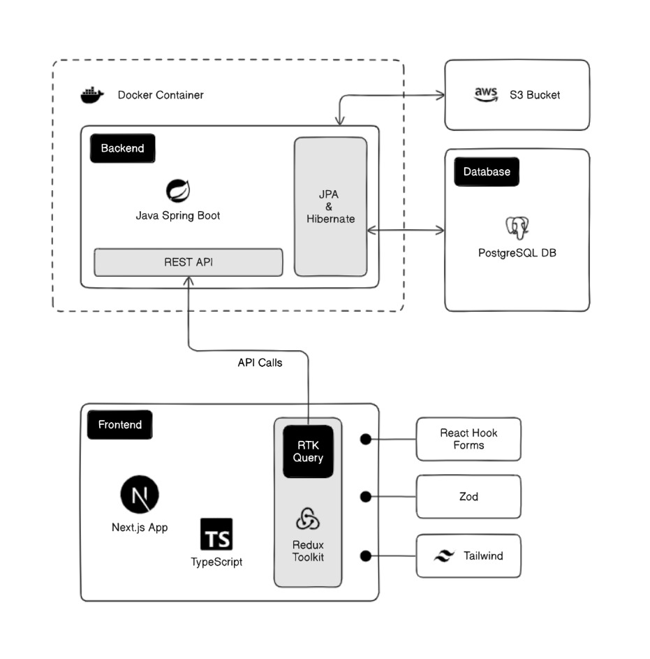

# Handy Man - Your Local Skill Network

HandyMan is a digital platform bridging homeowners with skilled handymen for on-demand repair and maintenance services. The system features **dual-role accounts** (users can switch between requesting or offering services), **bidding-based task assignments**, and **in-app messaging**. Built with `Next.js` (frontend), `Spring Boot` (backend), and `PostgreSQL`, it prioritizes local service matching, transparent pricing, and mutual review systems.

-   [Backend Repository](https://github.com/vishva-kalhara/handy-man-backend)
     

## Core Features

-   📌 Task posting with emergency tagging
-   💰 Budget-based bidding system
-   🛠️ Skills verification & ratings
-   📍 Location-based service matching
-   💬 Integrated chat

Goal: Streamline home services while empowering local tradespeople.

# Frontend Technologies

-   `Next.js 15`
-   `TypeScript`
-   `Redux Toolkit with RTK Query`
-   `Tailwind CSS`
-   `React Hook Form`
-   `Zod Validation`

# Environment Variables

-   `NEXT_PUBLIC_BASE_URL`: Base API URL

# ⚖️ License

Queue Up is an Open Source SaaS. [Licensed as MIT](https://github.com/vishva-kalhara/handy-man-frontend/blob/master/LICENSE)
